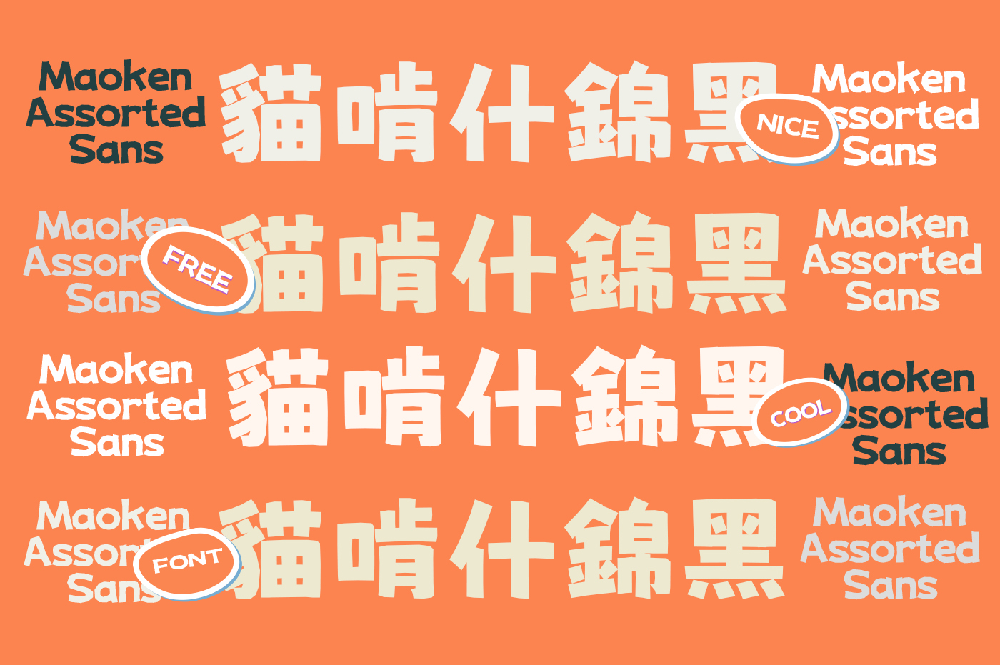
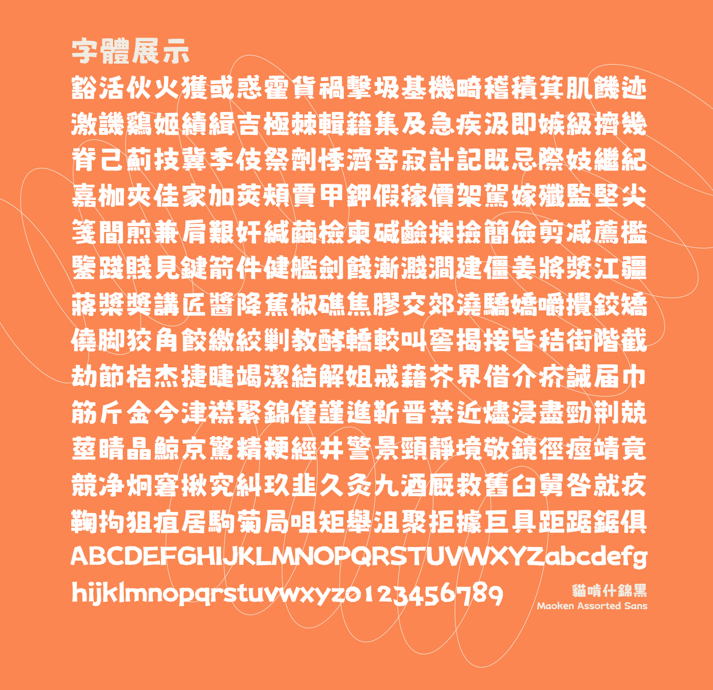

# 貓啃什錦黑 繁體中文版

## 簡介

貓啃什錦黑是基於日本作者[波間のかけひき](https://twitter.com/Umihotarus)創作的字體[《にしき的フォント》（Nishiki-teki）](https://umihotaru.work/)進行補充並對其中的漢字字形進行修改，以滿足中文使用需求的字體，是一款可愛的馬克筆手繪風格免費商用字體，筆劃活潑、有趣，特別適合用於可愛類、母嬰類等海報的標題。

本專案為繁體中文版，目前已補充並修改完 [GB/T 12345-1990](https://github.com/NightFurySL2001/cjktables/blob/master/china/encoding/gb_t_12345.txt)的前半部分以及[《常用國字標準字體表》](https://github.com/NightFurySL2001/cjktables/blob/master/taiwan/standard/edu_standard_1.txt)的所有漢字。

**注意：本字體的字形調整完全遵循個人喜好，僅遵循一般的舊字形字體寫法。**

## 字體預覽

## 授權資訊

本字體採用SIL Open Font License 1.1（SIL OFL 1.1）授權。

### 允許
- 一切商業使用；
- 轉載、分享字體檔；
- 將字體檔嵌入軟體中；
- 修改字體或製作衍生版本，衍生字體必須以SIL OFL 1.1發行。

### 不允許
- 將該字體作為商品進行販賣或進行變相收費（包括但不限於積分下載、與其他字體捆綁售賣、設置任何許可權門檻等）；
- 用於違反國家法律和公序良俗的任何場景。
- 在製作衍生字體時，字體名稱使用『什錦』『Assorted』等詞語。

若對本字體有意見或問題，歡迎於[issue頁面](https://github.com/Skr-ZERO/MaokenAssortedSans-TC/issues)提出。

## 下載管道

進入[『Release』頁面](https://github.com/Skr-ZERO/MaokenAssortedSans-TC/releases)下載對應版本的 TTF 或 OTF 檔。

## 致謝

- [波間のかけひき](https://twitter.com/Umihotarus) 提供原版字體；
- @白日月球、@阿東東東東、@荊南字坊、@時光羊、@帆影Shadow、@頻凡、@Y^Lin、@orunji協助補字；
- 所有下載使用的朋友。

## 打賞支持

